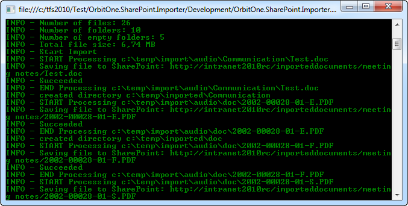

### IMPORTANT NOTICE:
Project restored from CodePlex Archive http://spbulkdocumentimport.codeplex.com "as is"  
I'm (msa48) not author and not work at OrbitOne company.

I was looking for useful tools to interact with old version of a SharePoint and unfortunately all the links point to a no longer existing codeplex resource. Thanks to the https://web.archive.org that at least he remembers 

Some other tools can be found there https://github.com/chrisdee/Tools/tree/master/SharePoint

---

# Project Description

Need to import/migrate files and folders from servers and network shares into SharePoint 2010 document libraries?  
This free commandline application helps you get the job done! Ideal for one-time migration of a large number of documents into SharePoint 2010.

# Features

* Run it anywhere. Every action is done using the Client Object Model, there is no need to install it on the server.
* Support for Mixed authentication, both Windows and Forms
* Import folders and files with all subfolders
* Retain creation and modified date fields after moving to SharePoint
* Retain author/editor fields from office documents after moving to SharePoint
* Incompatible file names are renamed (filename too long, illegal characters)
* Unsupported files (large filesize, blocked file extension, …) are skipped
* Files already existing on SharePoint are skipped (no overwrite)
* Successfully migrated files and folders can be moved to an “archive” folder
* Detailed log (Log4Net) with info on migration issues
* Option to skip creation of empty folders in SharePoint
* Option to merge subfolders to a flat list in SharePoint.
* Easy to run in batch when migrating several locations

  
  
  
**System Requirements**

* Microsoft SharePoint 2010 Server or Foundation
* .NET Framework 3.5

  
If you need more features, we refer to commercial solutions:

* Metalogic FileShare Migration Manager for SharePoint [http://www.metalogix.net](http://www.metalogix.net)
* Vyapin Document Import Kit for SharePoint (DocKit) [http://www.vyapin.com](http://www.vyapin.com)
* DocAve File System Migrator for Microsoft SharePoint [http://www.avepoint.com](http://www.avepoint.com)
* Office 365 Bulk Uploader [http://www.office365experts.be/en/products/office-365-bulk-uploader](http://www.office365experts.be/en/products/office-365-bulk-uploader)

  
Other open-source alternatives:

* FCI SharePoint Upload PowerShell script ([http://gallery.technet.microsoft.com/ScriptCenter/en-us/f538c34c-4f74-4645-9649-fd25e49805d6](http://gallery.technet.microsoft.com/ScriptCenter/en-us/f538c34c-4f74-4645-9649-fd25e49805d6))

  
  
**This project makes use of the following open source projects:**  
log4net [http://logging.apache.org/log4net/index.html](http://logging.apache.org/log4net/index.html)  
testApi: Command-Line Parsing APIs [http://testapi.codeplex.com](http://testapi.codeplex.com)  
  
  
Orbit One is a full-service solution provider located in Ghent, Belgium.  
We are specialised in the development of websites and web applications using Microsoft.NET, SharePoint, Umbraco and Dynamics CRM technologies.  
[http://www.orbitone.com](http://www.orbitone.com)
